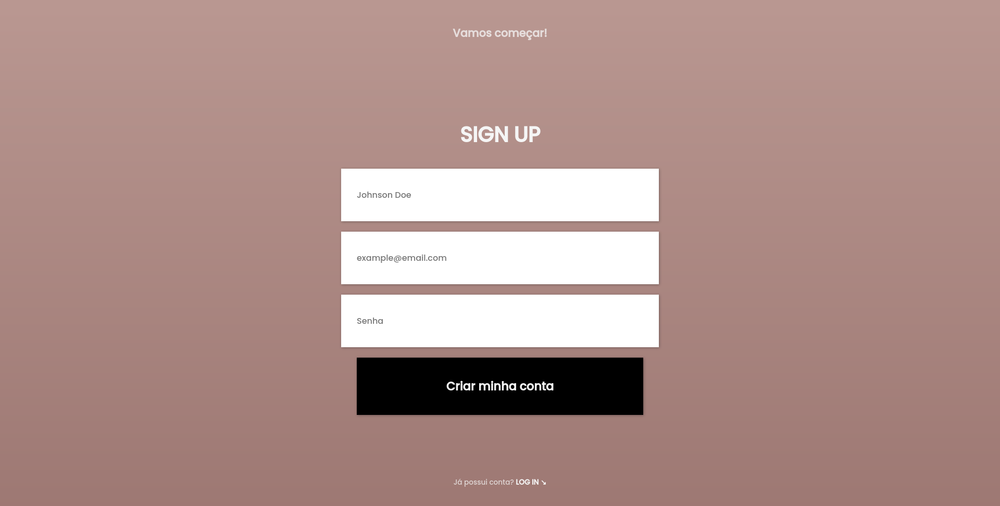

<h1>Mobile/Desktop Account LogIn/SignUp Interface</h1>

## About
LogIn/SignUp interface using HTML5 and CSS3

## Result

Access the project <a href="https://luk4x.github.io/projeto-mobile-template-login-singup/">HERE</a>

## 🤝 Contributors Linkedin
<table>
  <tr>
    <td align="center">
      <a href="https://www.linkedin.com/in/lucasmacielf/">
         
        
          <b>Lucas Maciel</b>
        
      </a>
    </td>
  </tr>
</table>
