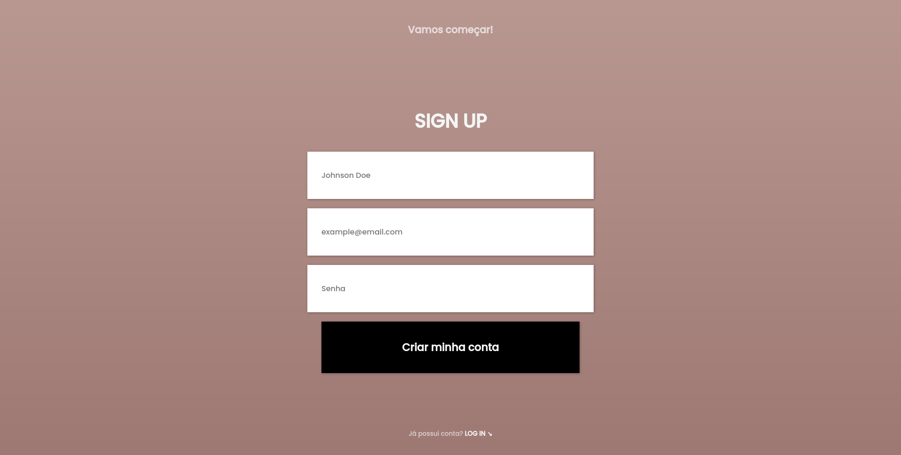
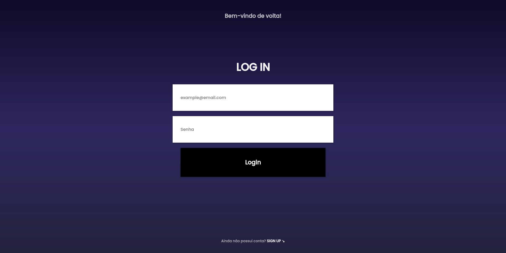

<table align="right">
  <tr>
    <td>
      <a href="readme-en.md">🇺🇸 English</a>
    </td>
  </tr>
  <tr>
    <td>
      <a href="README.md">🇧🇷 Português</a>
    </td>
  </tr>
</table>
<br>

# 🔓 LogIn/SignUp Interface




> Access the project online **[HERE](https://luk4x.github.io/projeto-mobile-template-login-singup/)**

## 📝 About

Responsive Login and SignUp interface built with HTML and CSS.

## 📖 Cloning the Project

To clone and run this project on your computer, you just need [Git](https://git-scm.com/) to be previously installed.<br>
After that, in the terminal:

```bash
# Clone this repository with:
> git clone https://github.com/Luk4x/projeto-mobile-template-login-singup.git

# Enter the repository with:
> cd projeto-mobile-template-login-singup

# Run the project with:
> start index.html # For Windows users
> open index.html # For Linux/Mac users
```

## 🤝 Contributor Contact

<table>
  <tr>
    <td align="center">
      <a href="https://www.linkedin.com/in/lucasmacielf/">
        <br>
        <sub>
          <b>Lucas Maciel</b>
        </sub>
      </a>
    </td>
  </tr>
</table>
